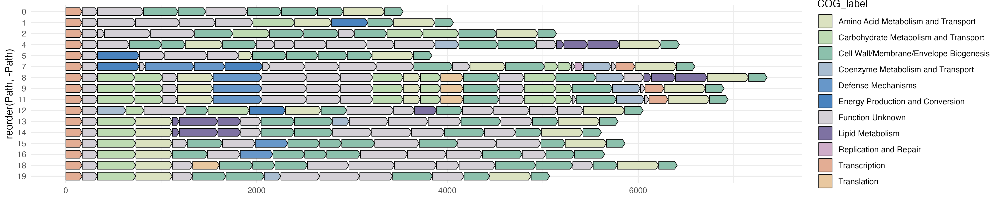

# Travis

## Introduction

Travis is a Python package designed to help with graph analysis and attribute addition. It consists of three main scripts: `path_finder.py`, `annotate.py`, and `plot.py`. The package leverages the networkx library for graph representation and pandas library for data manipulation. The scripts provide various functionalities for analyzing graphs and adding attributes to them.

## Prerequisites

- Python 3.x
- networkx library
- pandas library
- numpy library

## Installation

1. Clone the repository or download the script.
2. Install the required dependencies by running the following command:

```sh
pip install -e .
```

## Path Finder

The `pathfinder` command allows you to find all possible paths in a graph between a start gene and a stop gene. It uses the networkx library to represent the graph and perform graph traversal.

### Usage

Run the script with the following command:

```sh
travis-pathfinder --graph <graph_file> --start <start_gene> --stop <stop_gene> --output <output_folder>
```
- `<graph_file>`: Path to the graph file in GML format.
- `<start_gene>`: Start gene name.
- `<stop_gene>`: Stop gene name.
- `<output_folder>`: Path to the output folder.

### Output
The script generates the following output files in the specified output folder:

- `<start_gene>_path_full.csv`: Contains the full paths found between the start and stop genes, along with their unique identifiers.
- `<start_gene>_path.csv`: Contains a summary of the paths found, with the count of each path.
- `<start_gene>_graph.gml`: Represents a subgraph containing only the nodes and edges involved in the paths.
- `<start_gene>_member.csv`: Contains the member information for each path, showing which genome IDs are associated with each path.

## Graph Attribute Adder

The `annotate` command allows you to add additional data attributes from a dataframe to a graph file.

### Usage

Run the script with the following command:

```sh
travis-annotate --graph <graph_file> --metadata <metadata> --graph_name <graph_column> --metadata_column <metadata_column>
```

- `<graph_file>`: Path to your graph file in GML format.
- `<metadata>`: Path to your metadata file in TSV format.
- `<graph_column>`: Name of the column in the graph that corresponds to the desired attribute.
- `<metadata_column>`: Name of the column in the metadata that corresponds to the desired attribute.

The script will add the specified attribute to each node in the graph based on matching values between the graph and the dataframe.

### Output

The script will save the updated graph file with the added attributes. The output file will have a similar name to the input graph file, with "_updated" appended to it.

## Plot

The `plot` command generates a plot of all the operons using [gggenes](https://github.com/wilkox/gggenes).

### Usage

Run the script with the following command:

```sh
travis-plot --path <path_full.csv> --metadata <metadata> --output <output_folder>
```

- `<path_full.csv>`: Output from pathfinder.
- `<metadata>`: Path to your dataframe file, must include the columns Gene, Length, and Label
- `<output_folder>`: Path to the output folder.

The script generates a gggenes operon map of each possible path using the data from the specified dataframe file.

### Output

The command will produce a png image of the operons. Here is an example plot of PSA in *Bacteroides fragilis*. 



## License

This script is distributed under the terms of the Modified BSD License. See the `COPYING.txt` file included with this software for more information.